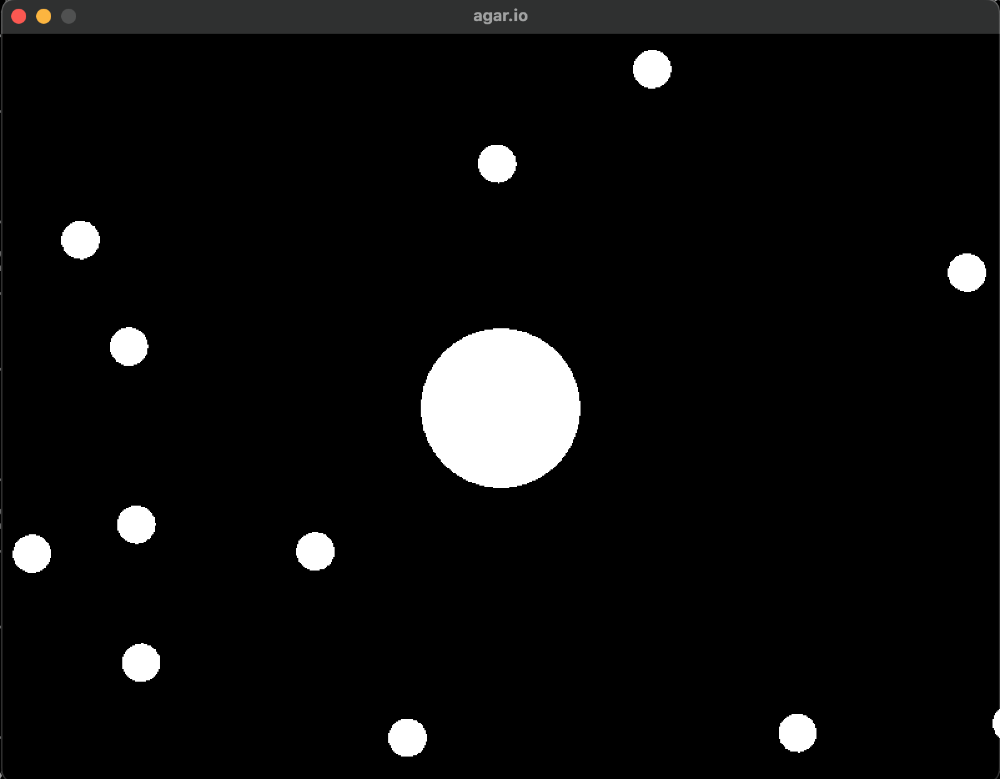

# agar.io

Made using the [LÖVE](https://love2d.org/) framework.

Inspired by this p5.js video by Daniel Shiffman: https://youtube.com/watch?v=jxuxymge4ki&list=plrqwx-v7uu6arpfixwba8zf6tjnzy5mfw&index=5

